# Document Portal - Visual Architecture Diagrams 📊

This document contains visual representations of the Document Portal architecture using Mermaid diagrams.

## 🏗️ System Architecture Overview

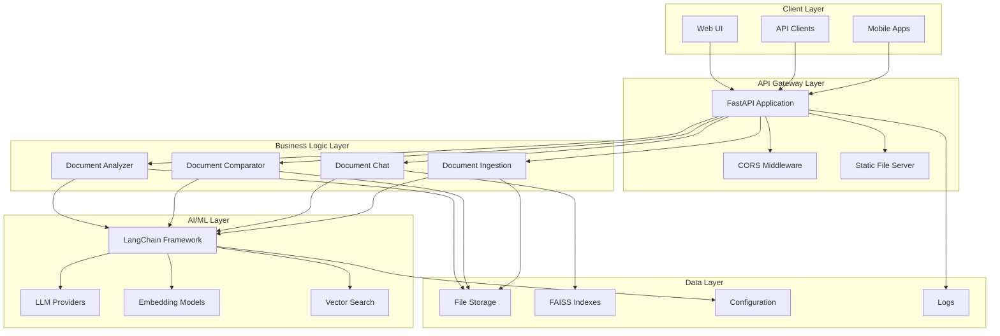

## 🔄 Data Flow Diagrams

### Document Analysis Flow

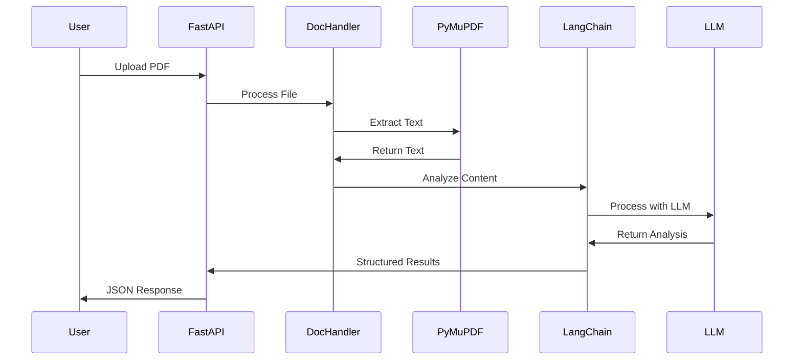

### Document Comparison Flow

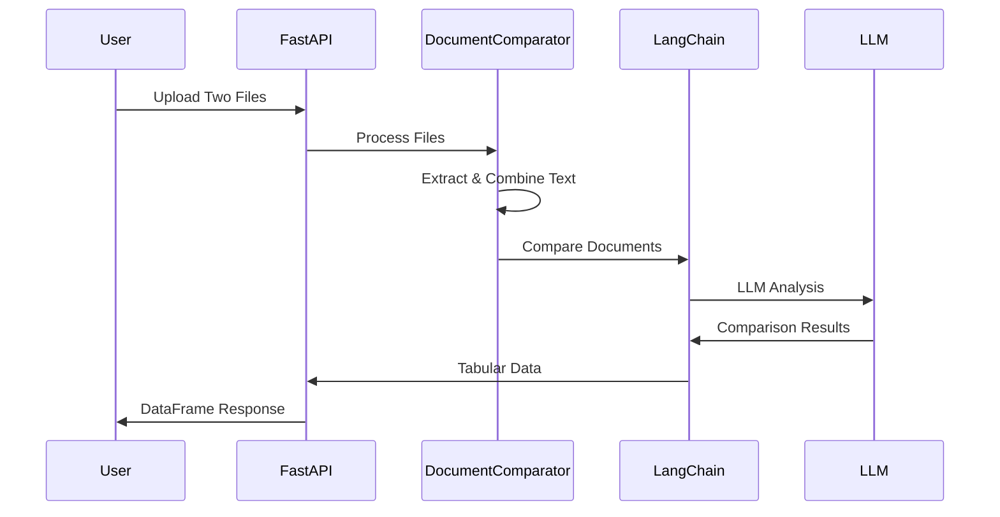

### Conversational AI Flow

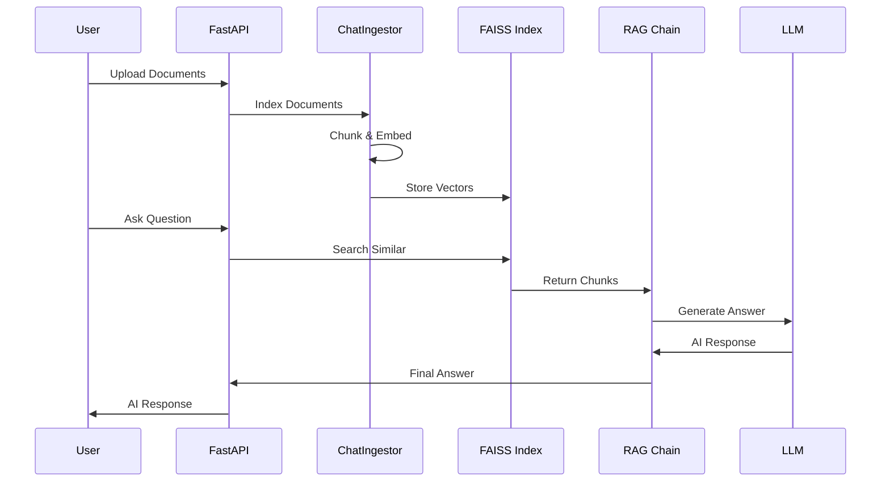

## 🏛️ Component Architecture

### Core Modules Structure

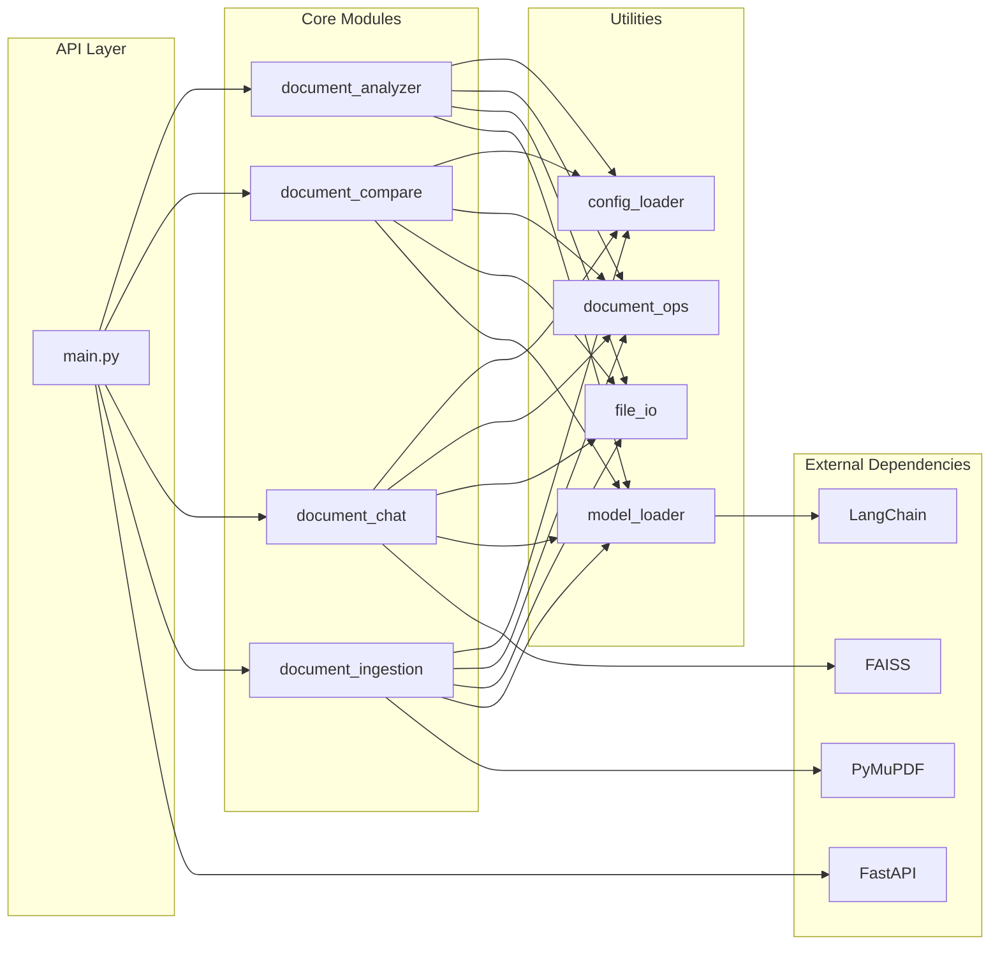

## 🔌 Integration Architecture

### LLM Provider Integration

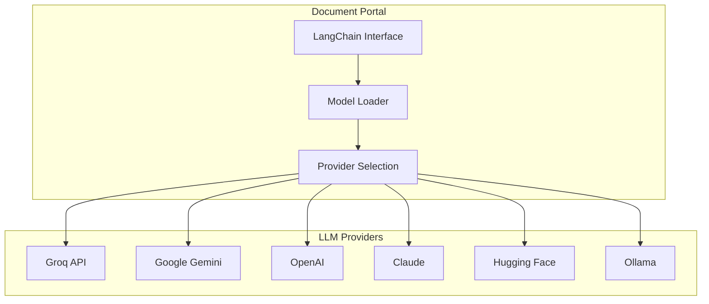

### Storage Architecture

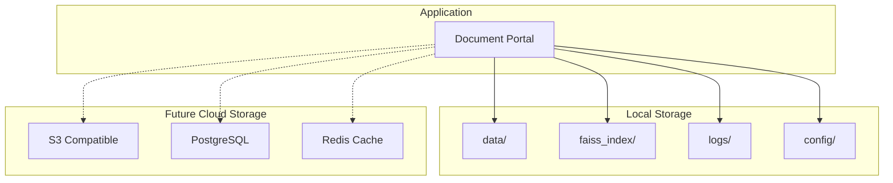

## 🚀 Deployment Architecture

### Development Environment

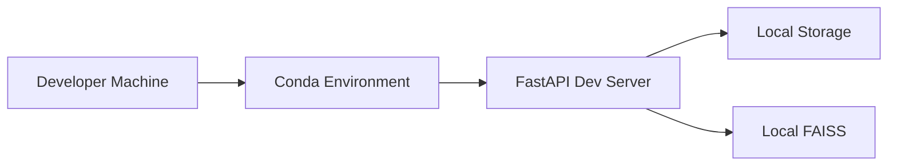

### Production Environment

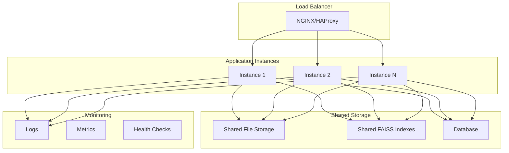

### Future Container Architecture

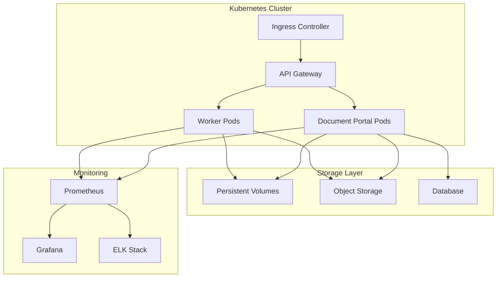

## 📊 Performance Metrics

### Response Time Distribution

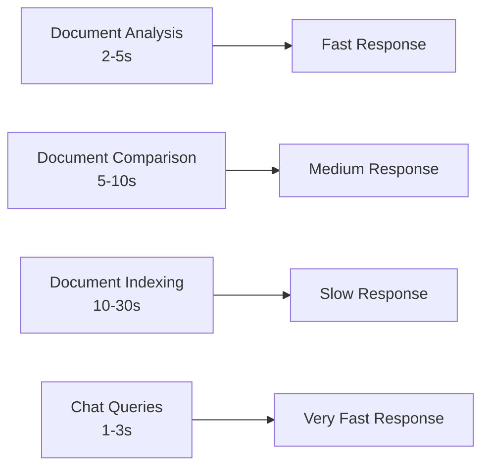

### Resource Usage Patterns

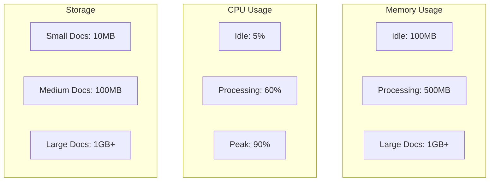

---

## 📝 Diagram Notes

- **Solid Lines**: Direct dependencies and data flow
- **Dashed Lines**: Future/planned integrations
- **Subgraphs**: Logical grouping of related components
- **Colors**: Different colors represent different layers (when rendered)

## 🔧 Rendering

These diagrams can be rendered in:
- **GitHub**: Native Mermaid support
- **GitLab**: Native Mermaid support
- **VS Code**: Mermaid extension
- **Online**: [Mermaid Live Editor](https://mermaid.live/)

---

*These diagrams are maintained by the CodeCoincognition Team. For updates or corrections, please open an issue on GitHub.*
